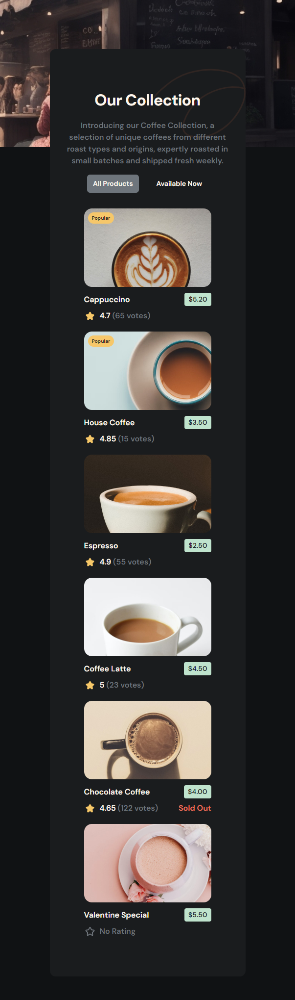
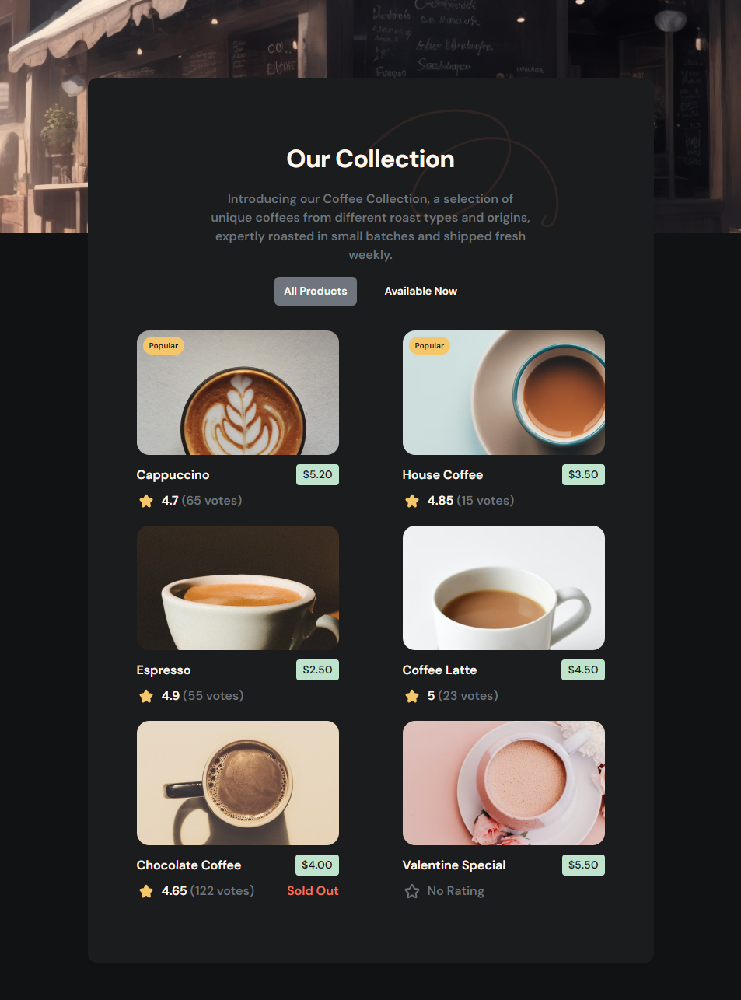
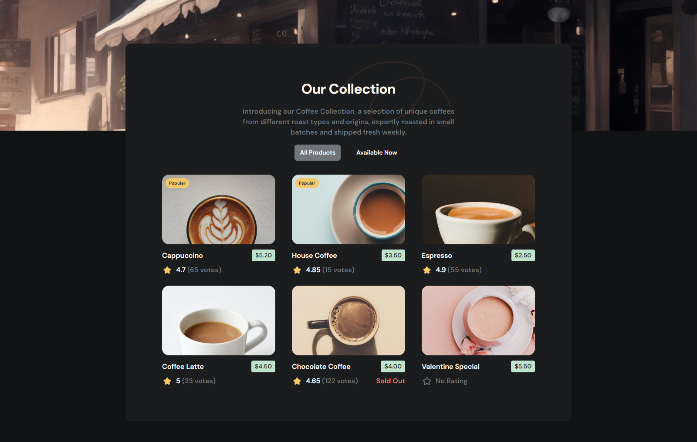
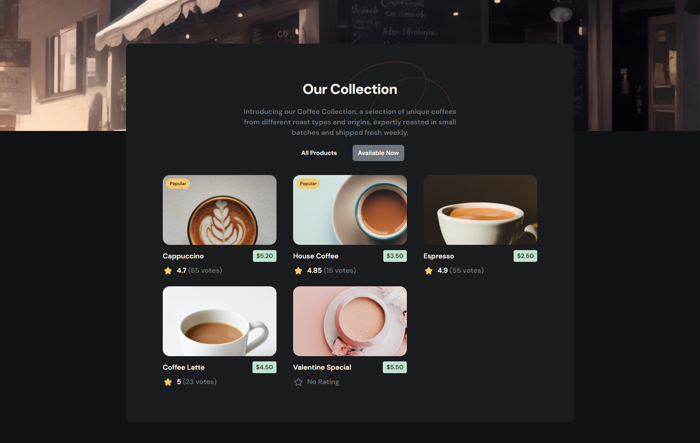

<h1 align="center">Dev Challenges - Simple Coffee Listing</h1>

<div align="center">
   This is a solution for a challenge from  <a href="http://devchallenges.io" target="_blank">Devchallenges.io</a>.
</div>

<div align="center">
  <h3>
    <a href="https://dev-challenges-simple-coffee-listing.vercel.app/" target="_blank">
      Demo
    </a>
    <span> | </span>
    <a href="https://devchallenges.io/solution/2856" target="_blank">
      Solution
    </a>
    <span> | </span>
    <a href="https://devchallenges.io/challenge/45">
      Challenge
    </a>
  </h3>
</div>


## Table of Contents

- [Overview](#overview)
  - [Built With](#built-with)
  - [Screenshots](#screenshots)
- [How to use](#how-to-use)
- [Recommended IDE Setup](#recommended-ide-setup)
- [Author](#author)

## Overview

This website was created as a submission to a [DevChallenges](https://devchallenges.io) challenge. The [challenge](https://devchallenges.io/challenge/45) was to build an application to complete the given user stories.

- Create a coffee listing page that matches the given design.

- Use React or other Front-end libraries for this challenge.

- Create a Reusable Card component.

- The card component should include a picture, name, pricing, rating, and number of votes if exists.

- The card component should render popular tag, availability status conditionally.

- Render Coffee list with given data. The data should come from a given API or downloaded JSON file.

- Users can choose to list all products or just available products.

- Deploy the solution and submit Repository URL and Demo URL

### Built With

- [Vue.js](https://vuejs.org/)
- [Axios](https://axios-http.com/)
- [Tailwind CSS](https://tailwindcss.com/)
- [Vite Js](https://vitejs.dev/)
- [Yarn](https://yarnpkg.com/)

### Screenshots

#### Mobile



#### Tablets



#### Desktop - All Products



#### Desktop - Available Now



## How To Use

To clone and run this application, you'll need [Git](https://git-scm.com) and [Yarn](http://yarnpkg.com) installed on your computer. From your command line:

```bash
# Clone this repository
$ git clone https://github.com/SouleymaneSy7/dev-challenges-simple-coffee-listing.git

# Install dependencies
$ yarn

# Run the app
$ yarn dev
```

## Recommended IDE Setup

- [VS Code](https://code.visualstudio.com/) + [Volar](https://marketplace.visualstudio.com/items?itemName=Vue.volar) (and disable Vetur) .

## Author

- GitHub - [Souleymane Sy](https://github.com/SouleymaneSy7)
- Dev Challenges - [Souleymane Sy](https://devchallenges.io/profile/534cd213-3165-4c16-bdcf-058e1f468da0)
- Frontend Mentor - [@SouleymaneSy7](https://www.frontendmentor.io/profile/SouleymaneSy7)
- Twitter - [@Souleymanesy43](https://twitter.com/Souleymanesy43)
